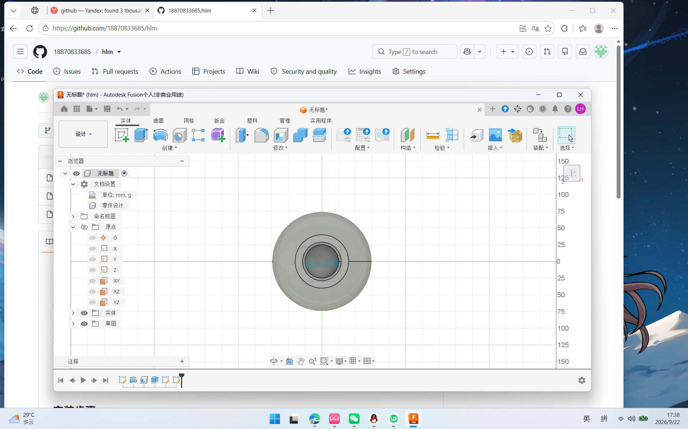
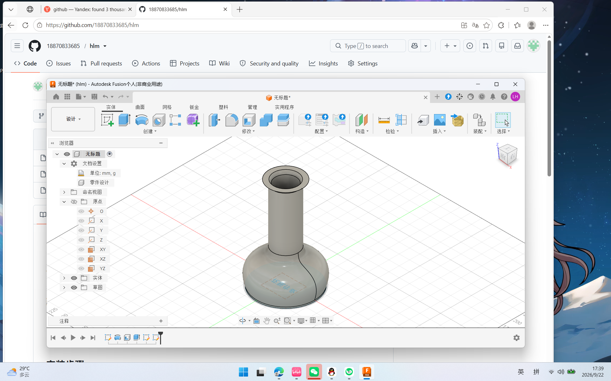
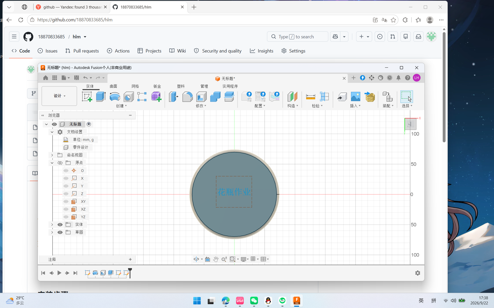

# hlm
# YES Lab ROS Task

## 环境
- Ubuntu 20.04.6 LTS
- ROS Noetic Ninjemys (ros_comm 1.17.4)
- VMware Workstation

## 安装步骤
1. VMware 新建虚拟机，安装 Ubuntu 20.04
2. 换清华 APT 源
3. 添加 ROS 清华源
4. sudo apt install ros-noetic-desktop-full
5. echo "source /opt/ros/noetic/setup.bash" >> ~/.bashrc
6. sudo rosdep init && rosdep update
7. roscore + turtlesim_node + turtle_teleop_key 测试

## 验证
- lsb_release 显示 Ubuntu 20.04
- rosversion 显示 noetic 1.17.x
- 方向键可控制小海龟移动

## 遇到的问题及解决办法
### 1. sudo 密码输入时不显示字符
解决：Linux 终端安全机制，盲打输入后回车即可。

### 2. 执行 roscore 提示 command not found
解决：新终端需执行 source ~/.bashrc 激活 ROS 环境变量。

### 3. 小海龟窗口被终端遮挡
解决：点击海龟窗口标题栏将其提到前面，控制时焦点切回终端按方向键。

### 4. 按方向键海龟不动
解决：鼠标焦点必须在运行 turtle_teleop_key 的终端内，不是海龟窗口。

## 提交内容
- ubuntu_ros_version.png：版本截图
- turtle_demo.mp4：小海龟控制录屏
- GitHub 用户名：18870833685

# YES Lab 第二阶段：Fusion 360 花瓶模型

作者 GitHub：18870833685

## 视角截图

软件：Autodesk Fusion 360  
方法：Sketch + Revolve
